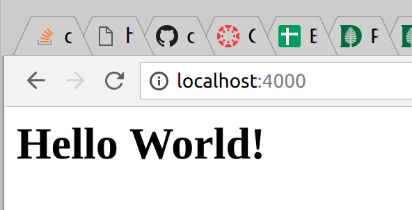

# CS52 Workshops: Introduction to Static Site Generation with Jekyll

The websites we've been building so far (think Lab 1 and 2) fall under the category of static sites. Static sites respond to requests much faster than dynamic ones, provide improved security since there's nothing dynamic to be exploited, and are better suited at handling traffic surges, as they only need to serve static files. If you are building a site where its information doesn't need to be constantly updated, static sites are a great option.

**_*Static site generators*_** allow an entire site to be built in one go on your computer before being put on the server. 

There are many different static site generators out there, but today we’re going to be working with a static site generator called **Jekyll**.

**Jekyll** is the static site generator behind the CS 52 course website, is integrated into GitHub, and is a pretty popular choice among static site generators these days.

## Overview


Today we’re going to show you how to generate a static sites using Jekyll.

We’ll be going over two different use cases of Jekyll for static site generation:
1. Using Jekyll's templates to building a static site from the ground up
2. Using Jekyll to turn a pre-existing site into a static site

For use case #1, we will be making a personal portfolio website.

**INSERT COMPLETED USE CASE 1 IMAGE**

For use case #2, we'll be transforming a typical HTML & CSS photo gallery site into a Jekyll site, and updating some functionalities on the site using Liquid.


## Setup

### Windows

1. Install a [Ruby+Devkit](https://rubyinstaller.org/) version . Use default options for installation.
2. Open a new command prompt window from the start menu, so that changes to the PATH environment variable becomes effective.
3. Install Jekyll and Bundler via: `gem install jekyll bundler`

### Mac 

1. In terminal, install Xcode command line tools: `xcode-select --install`

2. You should have homebrew by now so we're not going over that

3. Install Ruby `brew install ruby`

4. Install Jekyll `sudo gem install jekyll`

5. Install Jekyll Bundler `sudo gem install bundler`

### Check Jekyll

* `jekyll -v`

You should see this: `jekyll 3.8.5`

## Use Case #1: Using Jekyll Templates to Build a Static Site

Let's say you want to create a static site from scratch. Jekyll's templates allow you to quickly generate a static site. And now, we're going to do just that.

1. Use the command line to make a new directory. You will be placing all the files for your static site into this directory.

* `mkdir [insert_your_directory_name]` 
 
2. `cd` into your newly created directory.

3. Create your Jekyll site with the following command:

* `jekyll new template_site`

4. `cd` into the directory with your new site:

* `cd template_site`

5. Host it locally!

* `jekyll serve`

6. Visit localhost:4000 to check out your new site! 


And, voila! You now have a basic Jekyll site you can tweak at your own leisure.

## Use Case #2: Using Jekyll to Turn a Pre-Existing Site into a Static Site

#### 1. Create a site
  * Create a new directory for your site and name it whatever you'd like. Don't forget to initialize a Git repository.
  * Add your first file. Make an `index.html` file and add in the following code:
```<!doctype html>
<html>
  <head>
    <meta charset="utf-8">
    <title>Home</title>
  </head>
  <body>
    <h1>Hello World!</h1>
  </body>
</html> 
```

#### 2. Build the site
* We need Jekyll to build the site before we can view it. To do this, we can run two commands:
 * `jekyll build` - This will build our static site to a directory called `_site`.
 * `jekyll serve` - Does the same thing except it will rebuild any time you change the site and will run a local server a `http://localhost:4000`.
 * While developing the site it's better to use `jekyll serve` as it updates with any changes you make.
 * Go ahead and run `jekyll serve` and go to `http://localhost:4000` in your browser. You should see "Hello World!" like so:


#### 3. Learn Liquid :shower:

Liquid is a templating language specific to Jekyll. It has three main parts: objects, tags, and filters.
  ##### * Objects:
   * Objects are denoted by double curly braces and tell Liquid where to output content. For example, `{{ page.title}}` would output a variable called `page.title` on the page.
  ##### * Tags:
   * Tags are denoted by curly braces and percent signs: ``. Tags control the logic and control flow for the project. For example:

  ```
    <div class="sidebar">
      sidebar content
    </div>
  
  ```   
Outputs the sidebar if `page.show_sidebar` is true. 
  ##### * Filters
   * Filters change the output of a Liquid object. They must used within an output and are separated by a |, much like pipes used in unix. For example:
    ```{{ "hi" | capitalize}}```
    Outputs `Hi`.

:sunglasses: GitHub markdown files [support emoji notation](http://www.emoji-cheat-sheet.com/)

Here's a resource for [github markdown](https://guides.github.com/features/mastering-markdown/).


## Summary / What you Learned

* [ ] can be checkboxes

## Reflection

*2 questions for the workshop participants to answer (very short answer) when they submit the workshop. These should try to get at something core to the workshop, the what and the why.*

* [ ] 2 reflection questions
* [ ] 2 reflection questions


## Resources

* https://learn.cloudcannon.com/jekyll-setup/

For formatting inspiration:
* https://github.com/dartmouth-cs52-19S/workshop-ws-04-19-css
* https://github.com/dartmouth-cs52-19S/workshop-fancy-css-workshop

